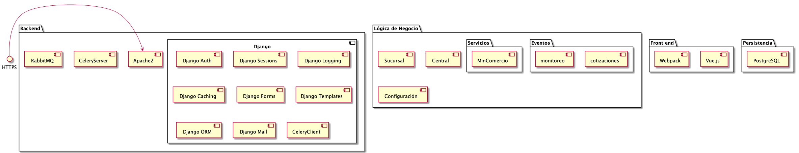
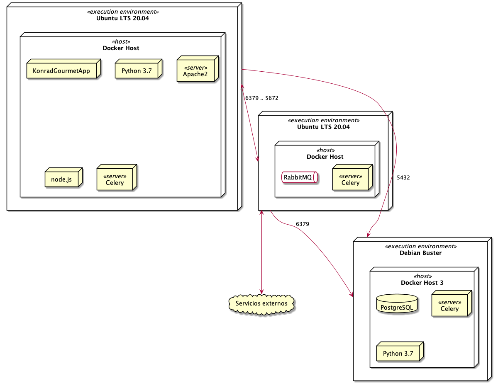

Documento de Arquitectura
=========================

Intoducción
-----------

El propósito de este documento es proveer una visión
exhaustiva del Sistema de Información de Konrad Gourmet,para
lo cual se utilizarán diferentes vistas arquitectónicas
. Pretende capturar y plasmar las decisiones que se han
hecho en el sistema.

Representación arquitectónica
------------------------------
Para describir el sistema, se han desarrollado
4 vistas:

1. Vista lógica

    Describe la conformación del software en cuanto sus componentes

2.  Vista de procesos

3. Vista de despliegue

4. Vista de implementación

Vista lógica
.............

El propósito de esta vista es mostrar, a nivel general,
los componentes de software utilizados para el
funcionamiento del sistema. Para resaltar, se
utilizara el framework Django como backend, puesto
que tiene ya bien integrados las funcionalidades estipuladas
en los RNF como autenticación, cifrado, capacidad para
activar auditoría, etc. Además, en el front-end se utilizará
un framework de Javascript: Vue.js, por su ligereza y
facilida de integración con Django. Los componentes de
front-end son necesarios para cumplir los RNF de usabilidad.

Vista de despliegue
....................

