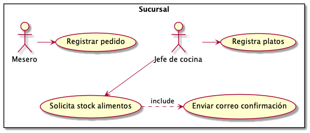
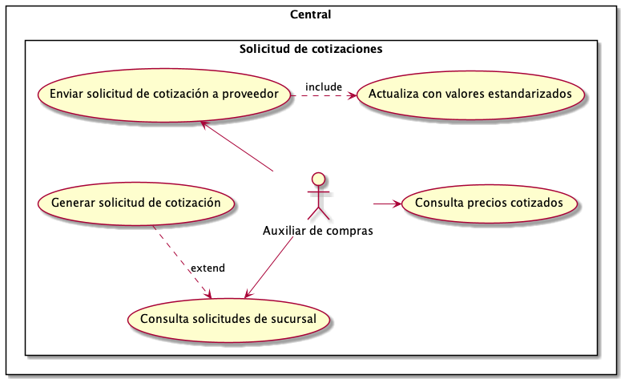
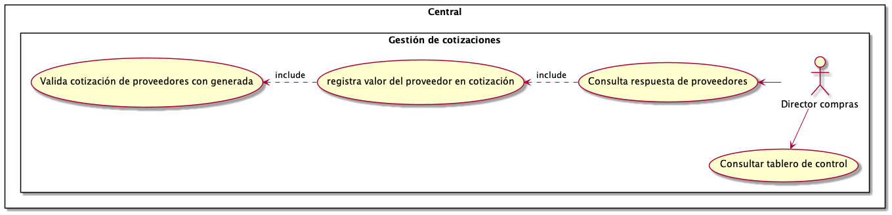
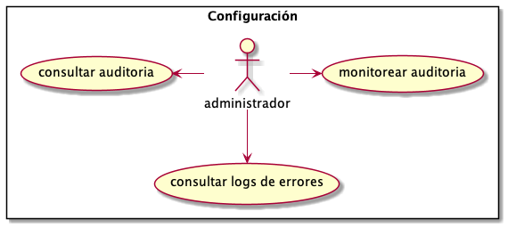
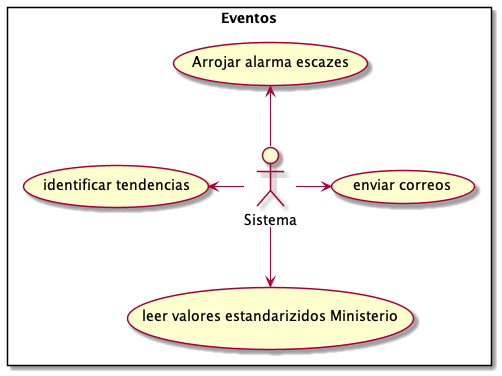

SRS
==============

Introducción
------------
El propósito de este SRS es 
describir los requerimientos 
funcionales y no funcionales
del sistema de abastecimiento
de alimentos para la cadena
Konrad Gourmet. Este documento
está dirigido a los miembros
del equipo de desarrollo 
y a los interesados. Los 
documentos especificados
aquí serán incluidos en el release
1.0

Ámbito del proyecto
-------------------
Konrad Gorumet es una cadena de
restaurantes que cuenta con varias sucurales.
Anteriormente, el proceso para consultar y 
actualizar su abastecimiento era manual,
por lo que era imposible consultar 
cifras exactas en tiempo real de todo
su inventario (los alimentos necesarios para
los platos que ofrecen a su cliente final). Esto ocasionaba pérdidas
por contar con cifras extactas con las
que solicitar cotizaciones a sus proveedores.

A raiz de eso, surgió la necesidad de implementar
un sistema que permita seguir el inventario
de las sucursales de Konrad Gorumet y que también automatize
y optimize las negociociones con sus proveedores.

Descripción general
--------------------
Konrad Gourmet es un sistema para
cuantificar el inventario de
varias sucursales de comida.
El sistema genera órdenes de compras,
facturas, y resúmenes del inventario
de distintas sucursales de Konrad
Gourmet. Una vez generada una cotización, 
el sistema le provee al Director de Compras
facilidades para validar si la respuesta del
proveedor es factible o no, de acuerdo
a la respuesta de otros proveedores, así 
como a los precios de los alimentos 
publicados por la entidad gubernamental 
correspondiente. 

Funcionalidades del sistema
----------------------------
Los siguientes casos de uso
fueron identificados. Se clasifican 
se agruparon para facilitar 
su comprensión en 4 áreas:

1. Sucursal
2. Central
3. Opciones de configuración
4. Eventos automáticos o de soporte

Sucursal
........

Central
.......

Opciones de configuración
.........................

Eventos automáticos o procesos de soporte
.........................................

Requerimientos de interfaces externas
-------------------------------------
Interfaces de software
......................
- La tecnología utilizada debe ser de libre licenciamiento
- Los lenguajes, frameworks y librerías deben ser las últimas versiones estables, reconocidas, con- soporte y de buenas prácticas
- Cualquier servicio que se tenga que exponer hacia un sistema externo, se debe hacer a través de SOAP
Atributos de calidad
---------------------
Requerimientos de usabilidad
.............................
- El sistema debe ser 'responisive', para ser utilizado desde dispositivos móviles
- El sistema debe poder cambiar de imagen corporativa de manera parametrizada, sin necesidad de 
recurrir a un diseñador gráfico

Requerimientos de confiabilidad
...............................
- El sistema debe poder recuperarse de desastres, debe tener un centro de datos alterno

Requerimientos de disponibilidad
................................
- El sistema debe ofrecer un 99,7% de alta disponibilidad

Requerimientos de desempeño
............................
- El sistema debe estar en capacidad de atender a 200.000 usuarios concurrentes
- El sisteba debe estar en capacidad de  procesar 1000 TPS

Requerimientos de seguridad
...........................
- El sistema debe contar con un módulo de autenticación y autorización
- El sistema debe poder manejar usuarios, perfiles o roles y permisos
- Cualquier comunicación debe estar asegurada con protocolo HTTPS
- La contraseña debe cumplir con un patrón de mínimo 8 caracteres que incluyan una mayúscula, una minúscula y un número
- La contraseña debe ser almacenada encripatada con algún algoritmo estándar
- Los correos emitidos deben estar certificados y con estampa cronológica

Requerimientos de mantenimiento
...............................
- Se espera un crecimiento de 200% en el almacenamiento de los documentos, archivos de carga
y la data 
- Se debe realizar backup diario de la base de datos
- Se debe contemplar el cambio fácil de motor de base de datos
- Cada acción del CRUD debe registrar su respectivo movimiento de auditoría con la 
siguiente información: 1) Acción, 2) Usuario, 3) Fecha, 4) Hora
- Cada error producido en el sistema debe quedar registrado en un log 

Requerimientos de portabilidad
..............................
No se solicitaron requerimientos de portabilidad.

Requerimientos específicos
==========================
.. csv-table:: Requerimientos específicos
   :file: prueba.csv
   :widths: 10 10 20 20 20
   :header-rows: 1
   :class: longtable
